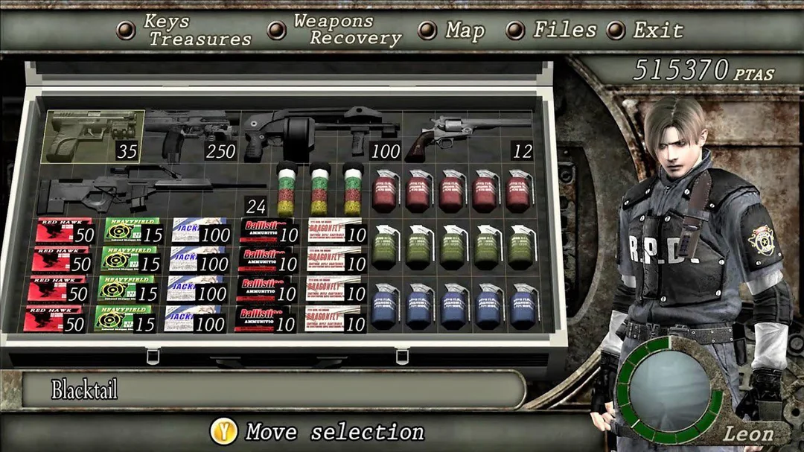

# In Ventory

Um Sistema para gestão de obrigações, patrimônio e de demandas de curto prazo. 

Exemplo 1: Preciso renovar o domínio do meu portfólio
  - Onde?
  - Como?
  - Por que?
  - Previsão de Valor

Exemplo 2: Quais serviços eu assino?
  - Onde?
  - Como?
  - Por que?
  - Previsão de Valor

O projeto é basicamente uma forma de consolidar "Patrimônio/Obrigações" por algum período. Vamos catalogar serviços, produtos e outras questões. Queremos saber se realmente possuímos aquilo. Meu pequeno **Inventário**.

_Minha inspiração veio direto de *RE4*:_

---

Vamos trocar uma ideia no LinkedIn:

[LinkedIn](https://www.linkedin.com/in/felipepinheiro2/)

---
